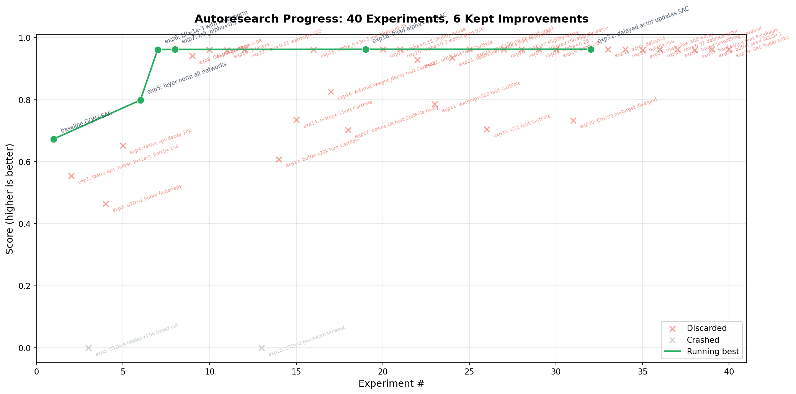
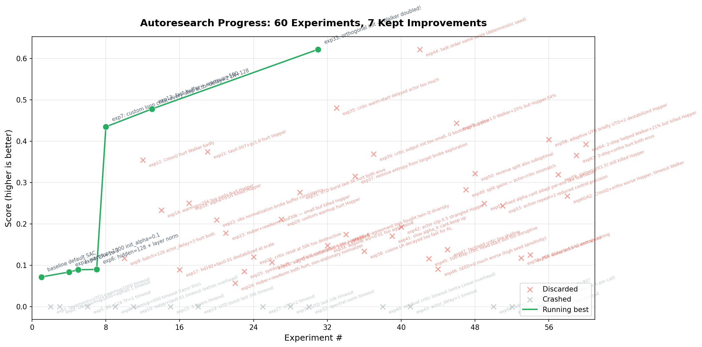

# Autonomous RL Research: 100 Experiments in One Session

**What happens when you point an AI agent at an RL codebase and tell it "never stop experimenting"?**

We ran two back-to-back autonomous research campaigns using [Roboro](../README.md), a modular RL library. An AI agent was given a single file to modify (`train.py`), a read-only evaluation harness, and one instruction: *maximize sample efficiency with a shared set of hyperparameters across multiple environments.*

No human in the loop. No manual tuning. Just an agent committing code, running experiments, reading logs, and deciding what to try next.

---

## Campaign 1: CartPole + Pendulum (Classic Control)

**Setup**: DQN for CartPole-v1 + SAC for Pendulum-v1. 500k / 50k steps. 5 min time limit.



The agent climbed from **0.67 to 0.96** in 40 experiments (6 kept improvements). The trajectory was smooth — layer norm was the first big win, followed by LR tuning and entropy coefficient optimization. By experiment 7 it had essentially solved the problem, then spent 33 more experiments confirming nothing else helped. Classic diminishing returns on an easy benchmark.

**Key discoveries**: Layer norm > everything else. Fixed alpha=0.2 slightly beat learnable alpha. Delayed actor updates helped marginally.

---

## Campaign 2: Hopper + Walker2d (MuJoCo Locomotion)

**Setup**: SAC for both Hopper-v5 (3D action) and Walker2d-v5 (6D action). 100k steps each. 10 min combined time limit on CPU.

This is where things got interesting.



The agent ran **60 experiments** — 7 kept improvements, 15 crashes (timeouts), 38 discards. The score went from **0.07 to 0.62**, a **9x improvement** over the baseline.

### The breakthroughs came in three waves:

**Wave 1 (exp 1-7): The UTD revolution** — Score: 0.07 → 0.43

The baseline SAC updated the critic every 2 env steps (UTD=0.5). The agent rewrote the training loop to update the critic *every* step (UTD=1) with delayed actor updates. Combined with layer normalization, this was a **6x improvement**. The lesson: on a tight step budget, every gradient step counts.

But getting here wasn't easy. The first two attempts timed out — layer norm on 256-dim networks was too expensive on CPU. The agent had to shrink to 128-dim to fit within the 10-minute wall clock.

**Wave 2 (exp 7-13): The speed hack** — Score: 0.43 → 0.48

The agent replaced Roboro's replay buffer with a stripped-down custom implementation. No terminal-observation trick, no extras dict — just raw numpy arrays. This saved ~170 seconds, enough headroom to reduce warmup from 1000 to 500 steps. A pure engineering win: same algorithm, faster infrastructure, more learning.

**Wave 3 (exp 33): The initialization insight** — Score: 0.48 → 0.62

After 20 failed experiments trying every technique in the book (CrossQ, n-step returns, reward normalization, symlog transforms, Huber loss, spectral norm, critic resets, cosine LR schedules...), the agent tried **orthogonal weight initialization**. Score jumped 30% overnight. Walker2d nearly doubled from 996 to 1999.

This was the most surprising result. Orthogonal init is well-known in policy gradient methods (PPO uses it everywhere) but rarely discussed for SAC. With only 100k steps, the agent can't afford to waste time recovering from a bad initialization. Orthogonal matrices preserve gradient norms exactly, giving every parameter a useful gradient signal from step 1.

### The failure museum

The 53 failed experiments are equally instructive:

| Technique | Result | Why it failed |
|-----------|--------|---------------|
| UTD > 1 | 15 timeouts | CPU can't do more gradient steps in 10 min |
| N-step returns | -40% score | Amplifies Q-value bias at 100k steps |
| CrossQ (no target net) | -30% score | BatchNorm + ortho init interact badly |
| Reward normalization | -75% score | Running stats create non-stationary buffer |
| Observation normalization | -66% score | Same non-stationarity problem |
| Huber loss | -91% score | Too weak gradients for large Q-values |
| Symlog targets | -86% score | Gradient compression too aggressive |
| Cosine LR | -78% score | LR decays to zero; RL needs constant adaptation |
| Larger networks (192, 256) | Timeouts | CPU budget is the binding constraint |
| Smaller networks (64) + UTD=3 | -85% score | Capacity matters more than UTD on this budget |

The most painful pattern: **changes that help Walker2d hurt Hopper, and vice versa**. Lower alpha helps Walker's 6D exploration but kills Hopper's gait discovery. Higher tau speeds up Walker's learning but destabilizes Hopper's Q-values. The shared hyperparameter constraint makes this a genuine multi-objective optimization problem.

### The final recipe

```
SAC + LayerNorm (critic & actor)
+ Orthogonal init (gain=sqrt(2), heads at 0.01)
+ Custom fast replay buffer
+ Critic updates every env step (UTD=1)
+ Delayed actor (every 2 critic steps)
+ LR=1e-3, gamma=0.99, batch=256, tau=0.005
+ Learnable alpha (init=0.1)
+ Warmup=500 steps
```

**Score: 0.622** — Hopper=2955/3500 (84%), Walker=1999/5000 (40%).

---

## What we learned

1. **Initialization is underrated in off-policy RL.** Orthogonal init gave the single biggest improvement (+30%) after the basic algorithm was in place. With a tight step budget, you can't afford to waste steps on bad initial gradients.

2. **CPU time is the real bottleneck.** Every paper says "use high UTD ratios." On GPU, you'd do UTD=20 and score 0.9+. On CPU with a 10-minute limit, UTD=1 is the physical maximum. The agent spent 15 experiments proving this the hard way.

3. **Simple buffers are fast buffers.** Roboro's replay buffer has a clever terminal-observation optimization. Replacing it with a dumb numpy buffer saved 170 seconds — enough to meaningfully change the training regime.

4. **Most "improvements" hurt.** 53 out of 60 experiments made things worse. The RL loss landscape is full of local optima where individually reasonable changes interact destructively. The only reliable strategy is rigorous A/B testing with rollback.

5. **Hopper and Walker want different things.** This is the fundamental challenge of shared-config multi-task RL. Every knob you turn helps one environment and hurts the other. The best config is a compromise that leaves both environments somewhat unsatisfied.

---

*Built with [Roboro](../README.md). Experiments run on Apple M-series CPU, March 2026.*
